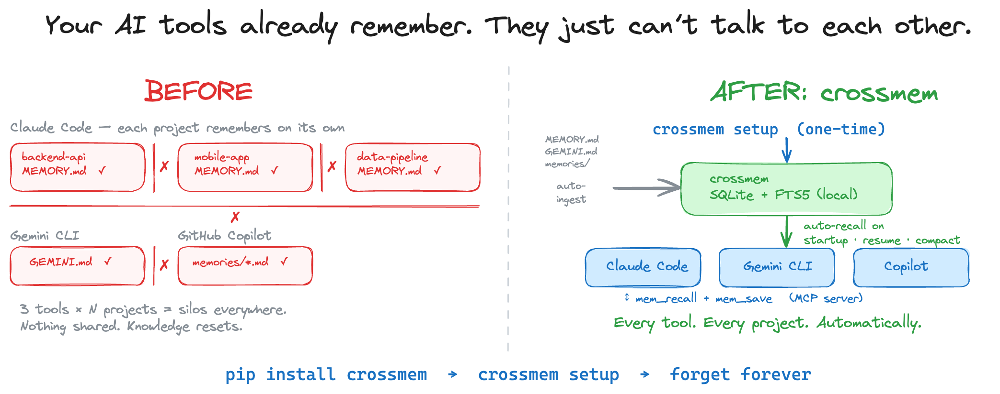

<p align="center">
  
</p>

<p align="center">
  <a href="https://pypi.org/project/crossmem/"></a>
  <a href="https://pypistats.org/packages/crossmem"></a>
  <a href="https://pypi.org/project/crossmem/"></a>
  <a href="https://github.com/Crack525/crossmem/blob/main/LICENSE"></a>
</p>

**Your AI tools forget. crossmem doesn't.**

Cross-tool memory for AI coding agents. One `pip install`, zero cloud, zero accounts — your Claude Code, GitHub Copilot, and Gemini CLI sessions remember everything, across every project, automatically.



## Quick start

```bash
pip install crossmem        # 1. Install
crossmem setup              # 2. Done. All tools configured.
```

That's it. Every AI coding session now starts with cross-project context.


## Why crossmem?

**40-50% of tokens in a typical AI coding session are wasted re-establishing context** the model already knew last session. In a real experiment, two AI agents (Claude Code and GitHub Copilot) both bypassed their own memory tools and re-derived everything from training data — proving the problem they were explaining.

crossmem fixes this by injecting remembered context **before the AI starts thinking** — not as a suggestion it can ignore, but as enforced context.

```
You: "How should I handle credentials in this new service?"

AI: [crossmem recalls patterns from 3 of your projects]
    Based on your backend-api, mobile-app, and infra-tools projects,
    you use a middleware layer for credential masking — keys in
    Secret Manager, never env vars, masked in logs via
    _mask_sensitive_headers(). Applying the same pattern here.
```

No copy-pasting. No "I already solved this." Your AI remembers — across every project.

## How it differs

| | crossmem | Mem0 | Letta | Zep |
|---|---|---|---|---|
| **Install** | `pip install` + SQLite | Cloud API key or self-hosted Qdrant | Server + Docker | Postgres + Go server |
| **Cross-tool** | Claude + Copilot + Gemini | Single app | Single app | Single app |
| **Cross-project** | All projects, one index | Per-app scoped | Per-agent scoped | Per-session scoped |
| **Protocol** | MCP-native | REST API | Custom framework | SDK |
| **Infrastructure** | None. Local SQLite. | Cloud or Qdrant + server | Letta server | Postgres + server |
| **Enforcement** | Hook injects context before generation | LLM decides to call API | LLM self-manages memory | LLM calls SDK |

## Works with

| Tool | Auto-recall | How |
|------|-------------|-----|
| **Claude Code** | SessionStart hook — fires on startup, resume, compact | `crossmem install-hook` |
| **GitHub Copilot** | Injects memories into copilot-instructions.md | `crossmem install-hook --tool copilot` |
| **Gemini CLI** | Instruction in GEMINI.md | `crossmem install-instructions` |

## What happens under the hood

```
cd ~/any-project
claude                    # Claude Code: hook fires, memories injected automatically
code .                    # Copilot: reads context pre-injected into copilot-instructions.md
gemini                    # Gemini: calls mem_recall via instruction in GEMINI.md
```

1. **Auto-ingest** — pulls latest memories from Claude, Copilot, and Gemini native files
2. **Auto-init** — first time in a project? Indexes README.md, CLAUDE.md, etc.
3. **Tiered recall** — returns most relevant context within a token budget:
   curated memories > tool memories > CLAUDE.md > CONTRIBUTING.md > README.md
4. **Learn** — AI saves new discoveries via `mem_save` during sessions. Knowledge compounds.

## MCP Server

Add to your tool's MCP config so AI assistants can search, recall, and save memories in real-time:

<details>
<summary><strong>Claude Code</strong> (<code>~/.mcp.json</code>)</summary>

```json
{
  "mcpServers": {
    "crossmem": {
      "command": "crossmem-server"
    }
  }
}
```
</details>

<details>
<summary><strong>GitHub Copilot</strong> (<code>.vscode/mcp.json</code>)</summary>

```json
{
  "servers": {
    "crossmem": {
      "command": "uvx",
      "args": ["--from", "crossmem", "crossmem-server"]
    }
  }
}
```
</details>

<details>
<summary><strong>Gemini CLI</strong> (<code>~/.gemini/settings.json</code>)</summary>

```json
{
  "mcpServers": {
    "crossmem": {
      "command": "crossmem-server"
    }
  }
}
```
</details>

> If `crossmem-server` isn't on PATH, use `uvx --from crossmem crossmem-server` instead.

### MCP Tools

| Tool | Description |
|------|-------------|
| `mem_recall` | Load project context + cross-project patterns at session start |
| `mem_search` | Search across all memories (query, project filter, limit) |
| `mem_save` | Save a discovery during a session |
| `mem_update` | Update a memory in place (preserves ID) |
| `mem_forget` | Delete a memory by ID |
| `mem_get` | Get full content of a memory by ID |
| `mem_init` | Index project documentation files |
| `mem_ingest` | Refresh the index from native tool memory files |

<details>
<summary><strong>CLI reference</strong></summary>

```bash
# Recall (runs automatically via hook)
crossmem recall                  # auto-detects project from cwd
crossmem recall -p backend-api   # explicit project
crossmem recall --format copilot # marker-wrapped for Copilot injection

# Search
crossmem search "JWT token rotation"
crossmem search "retry strategy" -p backend-api -n 5

# Save / Update / Delete
crossmem save "Always use middleware for credential masking" -p backend-api -s Patterns
crossmem update 42 "corrected content here"
crossmem forget 42

# Index project docs
crossmem init                        # current directory
crossmem init -p my-api --path ~/projects/api

# Hooks
crossmem install-hook                              # Claude Code
crossmem install-hook --tool copilot               # Copilot (workspace)
crossmem install-hook --tool copilot --global      # Copilot (all workspaces)
crossmem install-hook --tool copilot --if-stale    # refresh if >30 min old
crossmem install-instructions                      # Gemini

# Other
crossmem ingest       # re-ingest tool memories
crossmem graph        # visualize knowledge graph in browser
crossmem stats        # database stats
crossmem setup        # one-time: Claude hook + Copilot injection + Gemini instructions + ingest
```
</details>

## Supported tools

| Tool | Memory files |
|------|-------------|
| Claude Code | `~/.claude/projects/*/memory/*.md` |
| Gemini CLI | `~/.gemini/GEMINI.md` |
| GitHub Copilot (macOS) | `~/Library/Application Support/Code/User/globalStorage/github.copilot-chat/memory-tool/memories/*.md` |
| GitHub Copilot (Linux) | `~/.config/Code/User/globalStorage/github.copilot-chat/memory-tool/memories/*.md` |
| GitHub Copilot (Windows) | `%APPDATA%\Code\User\globalStorage\github.copilot-chat\memory-tool\memories\*.md` |

Ingestion is pluggable — PRs welcome for new tools.

## Contributing

Found a bug? Want to add support for another AI tool? [Open an issue](https://github.com/Crack525/crossmem/issues) or submit a PR.

If crossmem saves you from re-explaining your codebase to AI, consider giving it a star — it helps others find it.

## License

MIT
