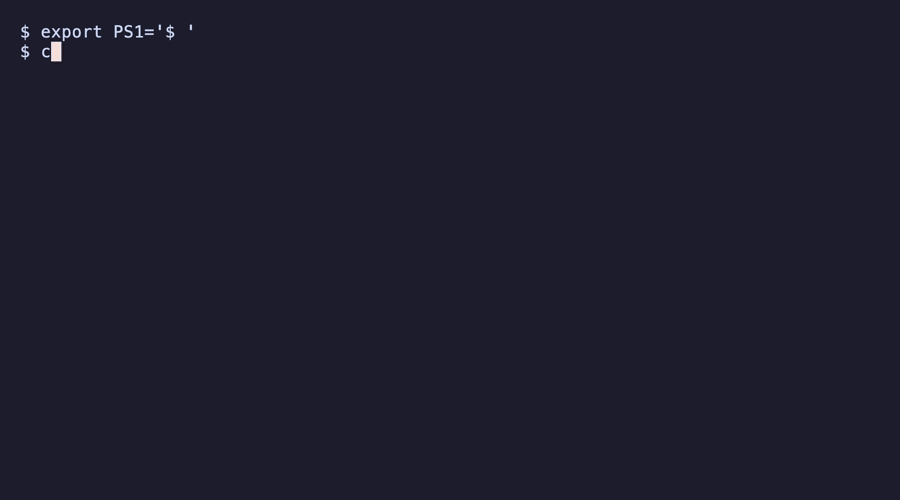

# crossmem

[](https://pypi.org/project/crossmem/)
[](https://pypi.org/project/crossmem/)
[](https://pypistats.org/packages/crossmem)
[](https://github.com/Crack525/crossmem/blob/main/LICENSE)

One search across all your Claude Code and Gemini CLI memories — every project, every tool.



## The problem

You use AI coding assistants across multiple projects. Each project's memories are locked in a silo — and each tool has its own silo too. You solved credential masking in your backend API three months ago, but when you need it in a new microservice, your AI assistant starts from scratch.

Here's what's happening under the hood:

```
~/.claude/projects/
├── backend-api/memory/MEMORY.md    ← Claude remembers here
├── mobile-app/memory/MEMORY.md    ← ...but can't see here
└── data-pipeline/memory/MEMORY.md ← ...or here

~/.gemini/GEMINI.md                ← Gemini's memories (separate silo entirely)
```

Every project is a silo. Every tool is a silo. Knowledge doesn't compound — it resets.

## The fix

```bash
$ crossmem ingest
Ingested: 42 memories across 4 projects (Claude Code + Gemini CLI)

$ crossmem search "credential masking"
Found 3 results for "credential masking":

[1] backend-api / Security
    Source: MEMORY.md
    - Credentials masked in experience_memory before persisting (_mask_actions)...

[2] mobile-app / Security
    Source: MEMORY.md
    - Credentials masked via _mask_context_credentials() + _mask_text()...

[3] backend-api / Security
    Source: GEMINI.md
    - Credential masking pattern: _mask_actions for persistence, _mask_text for logs...
```

Three results. Two projects. Two AI tools. One query. The pattern was already solved.

### How crossmem differs

- **vs Mem0** — Mem0 is cloud-based and requires an API key. crossmem is **local-only** with zero accounts.
- **vs Basic Memory** — Basic Memory works within one tool. crossmem aggregates **across tools and projects**.
- **vs grep** — crossmem parses multiple formats, deduplicates, and runs as an MCP server — your AI assistant queries it automatically at session start.

## Install

```bash
pip install crossmem
# or
uv pip install crossmem
```

## Quick start

```bash
pip install crossmem        # 1. Install
crossmem ingest             # 2. Index all your AI memories
crossmem search "retry"     # 3. Search across every project
```

That's it. Three commands, zero config. crossmem finds Claude Code and Gemini CLI memory files automatically.

To give your AI tools direct access, add the MCP server to your config (see [MCP Server](#mcp-server) below) — then `mem_recall()` and `mem_search()` just work inside your coding sessions.

## Usage

```bash
# Ingest Claude Code + Gemini CLI memories
crossmem ingest

# Search across every project
crossmem search "JWT token rotation"
crossmem search "retry strategy" -p backend-api
crossmem search "docker compose" -n 5

# Save a discovery
crossmem save "Always use middleware for credential masking" -p backend-api -s Patterns

# Delete stale or wrong memories
crossmem forget 42                   # delete memory #42 (with confirmation)
crossmem forget -p old-app           # delete all memories for a project
crossmem forget 42 --confirm         # skip confirmation prompt

# Sync Claude memories → Gemini CLI
crossmem sync                        # sync everything
crossmem sync -p backend-api        # sync one project + shared patterns

# Watch for changes and auto-sync
crossmem sync-watch                  # polls every 30s
crossmem sync-watch --interval 10    # custom interval

# Visualize the knowledge graph
crossmem graph

# See what's in the database
crossmem stats
```

## How it works

1. **Ingest** — Finds Claude Code and Gemini CLI memory files automatically, splits into chunks, deduplicates
2. **Index** — Stores everything locally in SQLite — no cloud, no API keys, no accounts
3. **Search** — Full-text search with stemming. Multi-word queries use AND logic; quoted phrases for exact matches
4. **Learn** — AI tools save new discoveries via `mem_save` during sessions. Knowledge compounds automatically
5. **Sync** — One-way sync from Claude → Gemini, preserving each tool's own memories

## How it works with your AI tools

Once the MCP server is configured, your AI assistant automatically uses crossmem:

```
You: "How should I handle credentials in this new service?"

AI: Let me check crossmem for existing patterns...
    [calls mem_recall → finds credential masking in 3 of your projects]

    Based on your previous work across backend-api, mobile-app, and infra-tools,
    you consistently use a middleware layer for credential masking. Here's the
    pattern from your backend-api project:
    - Credentials stored in Secret Manager, never in env vars
    - API keys masked in logs via _mask_sensitive_headers()
    ...
```

No copy-pasting. No "I already solved this." Your AI assistant recalls patterns from every project you've worked on — automatically.

## MCP Server

crossmem runs as an MCP server so AI coding tools can search, recall, and save memories in real-time.

### Setup

Add to your tool's MCP config:

**Claude Code** (`~/.mcp.json` for global, or `.mcp.json` in project root):
```json
{
  "mcpServers": {
    "crossmem": {
      "command": "crossmem-server"
    }
  }
}
```

**Gemini CLI** (`~/.gemini/settings.json`):
```json
{
  "mcpServers": {
    "crossmem": {
      "command": "crossmem-server"
    }
  }
}
```

**VS Code / GitHub Copilot** (`.vscode/mcp.json` in project root, or user `settings.json`):
```json
{
  "servers": {
    "crossmem": {
      "command": "uvx",
      "args": ["--from", "crossmem", "crossmem-server"]
    }
  }
}
```

> **Note:** For Claude Code and Gemini CLI, if `crossmem-server` isn't on PATH, use the same `uvx` command shown in the Copilot config above.

### Tools

| Tool | Description |
|------|-------------|
| `mem_recall` | Load project context + cross-project patterns at session start (auto-detects project from cwd) |
| `mem_search` | Search across all memories (query, project filter, limit) |
| `mem_save` | Save a discovery during a session — immediately searchable |
| `mem_forget` | Delete a memory by ID (find IDs via `mem_search`) |
| `mem_ingest` | Refresh the index when memory files change (auto-runs on server startup) |

### Start manually

```bash
crossmem serve    # starts MCP server on stdio (same as crossmem-server)
```

## Supported tools

| Tool | Ingestion |
|------|-----------|
| Claude Code | `~/.claude/projects/*/memory/*.md` |
| Gemini CLI | `~/.gemini/GEMINI.md` |
| VS Code / GitHub Copilot | Via MCP server (no direct ingestion — uses the shared index) |

Ingestion is pluggable — PRs welcome for new tools.

## License

MIT
